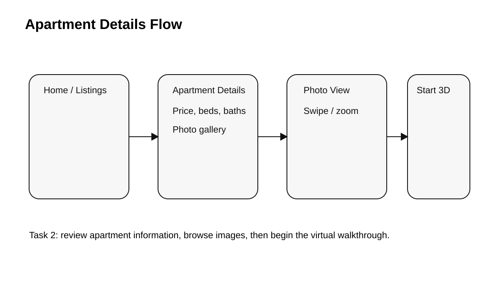
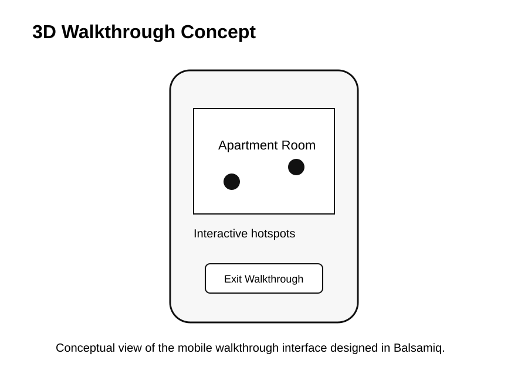
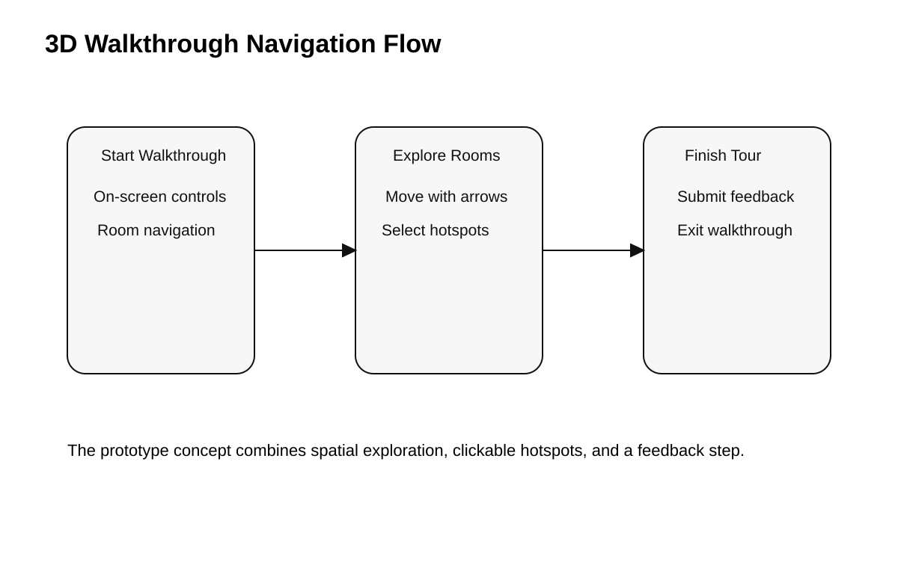

# College Living - Interactive Apartment Rental Prototype

A mobile-first interactive prototype for a student-focused apartment rental experience, created in **Balsamiq** for **ITIS 4350 - Rapid Prototyping (Summer 2024)**.

> **Project type:** Team UX/HCI prototyping project  
> **Platform:** Mobile  
> **Primary tool:** Balsamiq  
> **Methods:** Wireframing, interaction design, task flows, usability testing  
> **My documented focus:** Apartment Details / 3D Walkthrough

## Overview

**College Living** was designed to help students explore apartment communities near college campuses and complete common renter tasks from a mobile interface. The team built four connected prototype workflows:

1. **Map search for apartments**
2. **Apartment details and 3D walkthrough**
3. **Maintenance / issue reporting**
4. **Apartment-community social feed**

The goal was to move from early sketchbook wireframes to a highly interactive Balsamiq prototype, connect the major user flows, and evaluate the experience with users.

## My Contribution - Apartment Details / 3D Walkthrough

My primary responsibility was **Task 2: Apartment Details / 3D Walkthrough**. I designed a flow that lets a prospective renter review apartment information and move into an immersive virtual-tour experience.

Key interactions included:

- Viewing apartment details such as address, rental price, bedrooms, and bathrooms
- Navigating a photo gallery with carousel-style controls
- Supporting swipe and zoom interactions in the prototype concept
- Starting and exiting a 3D apartment walkthrough
- Navigating between apartment rooms
- Using interactive hotspots to reveal additional information
- Providing a feedback step after the walkthrough
- Maintaining consistent mobile navigation across the experience

## Prototype Preview

The preview images below use GitHub-friendly SVGs so they render consistently without broken-image or question-mark errors. They summarize the flows from the original Balsamiq prototype archive.

### Apartment details flow

This flow shows the path from apartment listings to apartment details, the photo gallery, and the entry point into the 3D walkthrough.

### 3D walkthrough concept

The walkthrough concept represents the mobile room-view experience, interactive hotspots, and the exit action back to apartment details.

### Interaction-flow overview

> The original prototype archive contains additional screens for bedroom exploration, apartment maps, maintenance reporting, apartment search, and the community feed. See `prototype/SCREEN_INDEX.md` for the full screen list.

## Design Process

The project followed a rapid-prototyping workflow:

1. **Sketch** - Create early paper wireframes for the task flow.
2. **Prototype** - Translate the sketches into interactive mobile wireframes in Balsamiq.
3. **Connect** - Link screens and actions into a sequential user flow.
4. **Test** - Evaluate the prototype with users using task-based prompts.
5. **Reflect and iterate** - Identify usability strengths, pain points, and opportunities for improvement.

## User Study

The team evaluated the full prototype with **four participants**. Feedback related to the apartment-details and 3D-walkthrough experience was generally positive:

- Participants found the navigation straightforward and easy to follow.
- Navigation controls and the overall layout were viewed as clear and consistent.
- The apartment-space representation and 3D walkthrough were well received.
- Suggested improvements included a loading indicator for the walkthrough and a more structured feedback form.

These findings reinforced the value of testing even a mid-fidelity prototype before investing in a more complete implementation.

## Design Patterns and UX Concepts

The prototype explored several HCI and interaction-design concepts, including:

- Mobile-first interface design
- Visual hierarchy
- Consistent navigation patterns
- Photo carousel interactions
- Interactive maps and spatial navigation
- Progressive task flows
- Touch-friendly controls
- Feedback dialogs
- Interactive hotspots
- User-centered iteration based on usability feedback

## Tools and Skills

- **Balsamiq**
- Rapid prototyping
- Wireframing
- Interaction design
- UX / HCI design
- Mobile interface design
- User-flow design
- Usability testing
- User feedback synthesis
- Design critique and iteration
- Team collaboration

## Repository Contents

| Path | Description |
| --- | --- |
| `README.md` | Portfolio-oriented overview of the project and my documented contribution |
| `PROJECT_INFO.md` | Course, project, contribution, and team information |
| `assets/` | GitHub-friendly prototype flow visuals |
| `prototype/SCREEN_INDEX.md` | Index of the 52 exported Balsamiq prototype screens |

## Team

This was a collaborative team project completed by:

- **Qudrat Siyal** - documented focus: Apartment Details / 3D Walkthrough
- Aaron Rovnak
- Ayisha Riaz
- Chris Parker

The repository presents the complete team concept while clearly identifying my individual contribution.

## What I Learned

This project strengthened my ability to turn an early concept into a testable interactive experience. It also gave me practical experience connecting individual screens into a coherent user journey, designing for mobile interaction, and using user feedback to identify improvements before moving toward higher-fidelity development.

It also demonstrated an important part of rapid prototyping: the prototype does not need to behave exactly like a finished application to reveal whether users understand the workflow, navigation, and interaction model.
